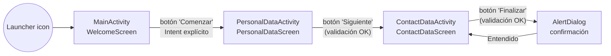
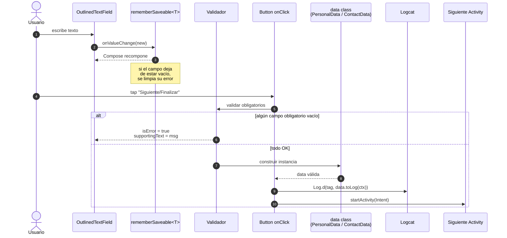
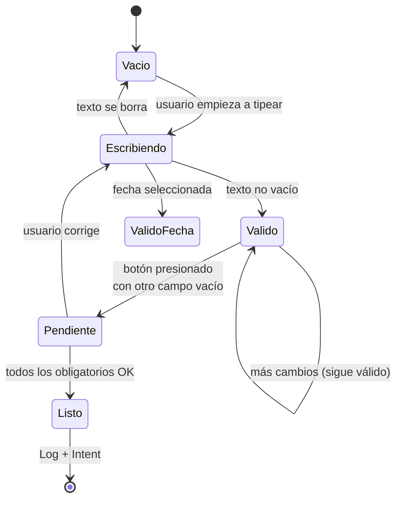
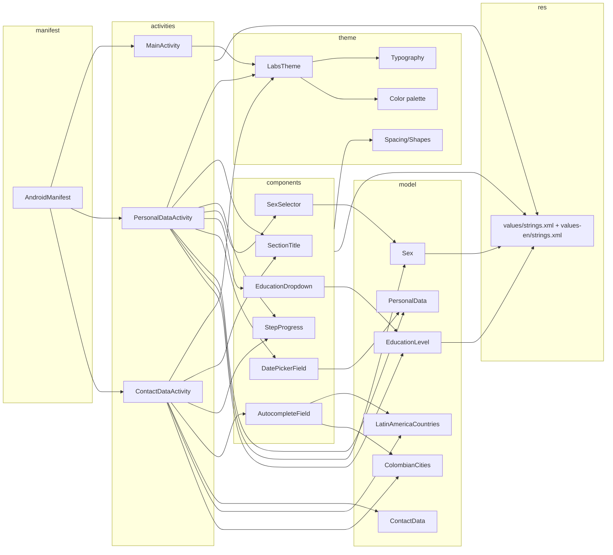
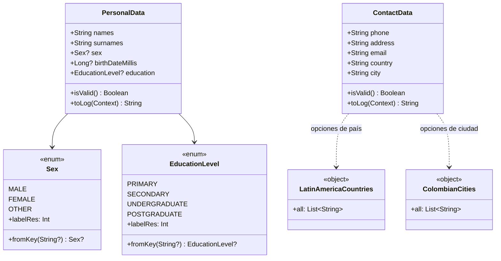
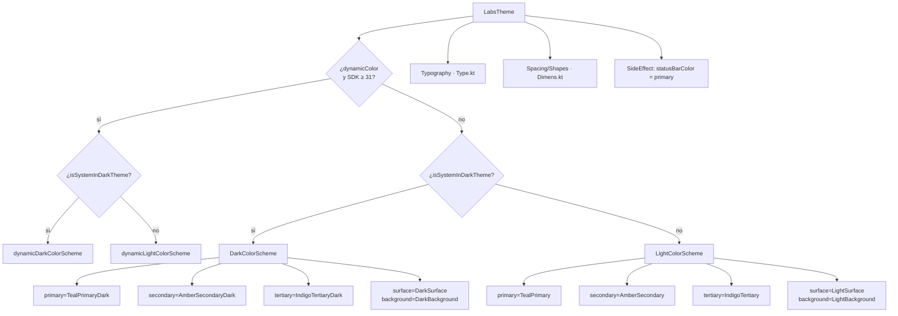

# Plan de diagramas

> Los diagramas están escritos en **Mermaid** y se renderizan
> automáticamente en GitHub, GitLab, VS Code (con la extensión
> *Markdown Preview Mermaid Support*) y Android Studio (con el plugin
> *Mermaid*).

---

## Índice de diagramas

| # | Diagrama                       | Qué responde                                                |
|---|--------------------------------|-------------------------------------------------------------|
| 1 | Navegación entre Activities    | ¿A qué pantalla va el usuario y desde dónde?                |
| 2 | Flujo de entrada de datos      | ¿Cómo viaja lo que escribe el usuario hasta Logcat?         |
| 3 | Árbol de componentes UI        | ¿Qué Composables componen cada pantalla?                    |
| 4 | Estados de validación          | ¿Cuándo aparece y desaparece cada error?                    |
| 5 | Mapa de capas                  | ¿Quién depende de quién?                                    |
| 6 | Modelo de datos                | ¿Qué campos tiene cada `data class`?                        |
| 7 | Sistema de temas               | ¿Cómo se eligen colores, tipografía y formas?               |

---

## 1. Navegación entre Activities



**Notas**

- No hay back‑stack personalizado; cada Activity se abre con
  `startActivity(Intent)` estándar.
- El botón *Atrás* del sistema regresa siempre a la pantalla previa
  sin perder estado (gracias a `rememberSaveable`).

---

## 2. Flujo de datos (entrada → Logcat)



---

## 3. Árbol de componentes de cada pantalla

### Welcome

```mermaid
graph TD
    A[MainActivity.setContent] --> B[LabsTheme]
    B --> C[Scaffold]
    C --> D[WelcomeScreen]
    D --> D1[Surface · badge circular]
    D1 --> D2[Icon · PersonAdd]
    D --> D3[Text · welcome_title]
    D --> D4[Text · welcome_subtitle]
    D --> D5[Text · welcome_description]
    D --> D6[Button · "Comenzar"]
```

### PersonalData

```mermaid
graph TD
    A[PersonalDataActivity] --> B[LabsTheme]
    B --> C[Scaffold]
    C --> CTB[PersonalTopBar]
    C --> SCR[PersonalDataScreen]
    SCR --> S1[SectionTitle]
    SCR --> S2[StepProgress · 1/2]
    SCR --> K1[Card · "Datos básicos"]
    K1 --> K1a[OutlinedTextField · nombres]
    K1 --> K1b[OutlinedTextField · apellidos]
    K1 --> K1c[SexSelector]
    SCR --> K2[Card · "Datos adicionales"]
    K2 --> K2a[DatePickerField]
    K2 --> K2b[EducationDropdown]
    SCR --> BTN[Button · "Siguiente"]
```

### ContactData

```mermaid
graph TD
    A[ContactDataActivity] --> B[LabsTheme]
    B --> C[Scaffold]
    C --> CTB[ContactTopBar]
    C --> SCR[ContactDataScreen]
    SCR --> S1[SectionTitle]
    SCR --> S2[StepProgress · 2/2]
    SCR --> K1[Card · "Cómo contactarte"]
    K1 --> K1a[OutlinedTextField · teléfono]
    K1 --> K1b[OutlinedTextField · dirección]
    K1 --> K1c[OutlinedTextField · email]
    SCR --> K2[Card · "Ubicación"]
    K2 --> K2a[AutocompleteField · país]
    K2 --> K2b[AutocompleteField · ciudad]
    SCR --> BTN[Button · "Finalizar"]
    SCR --> DLG[AlertDialog · confirmación]
```

---

## 4. Máquina de estados de validación



**Reglas por campo**

| Campo                | Tipo de validación             | Mensaje (`error_*`)             |
|----------------------|--------------------------------|---------------------------------|
| Nombres              | `isNotBlank()`                 | `R.string.error_required`       |
| Apellidos            | `isNotBlank()`                 | `R.string.error_required`       |
| Fecha de nacimiento  | `!= null`                      | `R.string.error_required`       |
| Teléfono             | `isPhoneValid()` (7–15 dígitos/+/‑/() ) | `R.string.error_invalid_phone` |
| Email                | `isEmailValid()` (Patterns.EMAIL_ADDRESS) | `R.string.error_invalid_email` |
| País                 | `isNotBlank()`                 | `R.string.error_no_country`     |
| Dirección            | opcional                       | —                               |
| Ciudad               | opcional                       | —                               |
| Sexo, Escolaridad    | opcional                       | —                               |

---

## 5. Mapa de dependencias entre capas



Reglas:

- **activities → components** ✅ permitido (las pantallas usan los
  componentes).
- **components → model** ✅ permitido solo si el componente es
  genérico y necesita conocer el enum (e.g. `SexSelector`, `EducationDropdown`,
  `DatePickerField`).
- **model → ui** ❌ **prohibido**: el modelo nunca importa Compose.
- **theme** es transversal: lo importan las activities y los
  componentes, pero no depende de nadie.

---

## 6. Modelo de datos



**Persistencia**

- Mientras la Activity está viva: `rememberSaveable` (sobrevive a
  rotación, cambio de tema y de idioma).
- Al terminar la Activity (back del sistema, finish): se pierde.
  *No se persiste en disco* porque no es requisito.

---

## 7. Sistema de temas



**Roles M3 usados**

- `primary` / `onPrimary` → barra superior y FAB‑style.
- `primaryContainer` / `onPrimaryContainer` → badge de la pantalla de
  inicio.
- `surface` / `onSurface` → fondo de Cards y texto por defecto.
- `surfaceVariant` / `onSurfaceVariant` → textos secundarios y track
  de la `LinearProgressIndicator`.
- `error` / `onError` → borde rojo y texto de error en los campos
  obligatorios.

---

## Cómo generar los diagramas externamente

Si necesitas exportarlos a PNG/SVG (por ejemplo para el informe
escrito), puedes:

1. Copiar el bloque Mermaid y pegarlo en
   <https://mermaid.live> → *Export → PNG/SVG*.
2. O usar la CLI:
   ```bash
   npm i -g @mermaid-js/mermaid-cli
   mmdc -i docs/DIAGRAMS.md -o diagrams/ -t neutral
   ```

Para versiones impresas del laboratorio, los diagramas **1**, **4** y
**5** son los más útiles (navegación, validación y dependencias).
